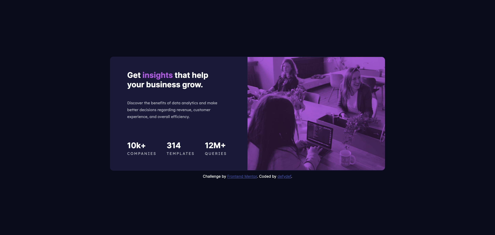

# Frontend Mentor - Stats preview card component solution

This is a solution to the [Stats preview card component challenge on Frontend Mentor](https://www.frontendmentor.io/challenges/stats-preview-card-component-8JqbgoU62). Frontend Mentor challenges help you improve your coding skills by building realistic projects. 

## Table of contents

- [Overview](#overview)
  - [The challenge](#the-challenge)
  - [Screenshot](#screenshot)
  - [Links](#links)
- [My process](#my-process)
  - [Built with](#built-with)
  - [What I learned](#what-i-learned)
  - [Continued development](#continued-development)
  - [Useful resources](#useful-resources)
- [Author](#author)
- [Acknowledgments](#acknowledgments)

## Overview

### The challenge

Users should be able to:

- View the optimal layout depending on their device's screen size

### Screenshot

### Links

- Solution URL: https://github.com/defydef/stats-preview-card-component
- Live Site URL: https://defydef.github.io/stats-preview-card-component

## My process

### Built with  

- Semantic HTML5 markup
- CSS custom properties
- Flexbox
- CSS Grid
- Mobile-first workflow

### What I learned

- Learned a new CSS attribute: mix-blend-mode, which sets how an element's content should blend with the content of the element's parent and the element's background.
- In this challenge, I used 'multiply' as the mix-blend-mode value 

### Continued development

- Solve more challenges in Frontend Mentor

### Useful resources

- https://developer.mozilla.org/en-US/docs/Web/CSS/mix-blend-mode - This helped me to learn about mix-blend-mode and CSS attributes in general

## Author

- Website - [defydef](https://github.com/defydef/)
- Frontend Mentor - [@defydef](https://www.frontendmentor.io/profile/defydef)

## Acknowledgments

Thank you Frontend Mentor for providing the challenge! 😄